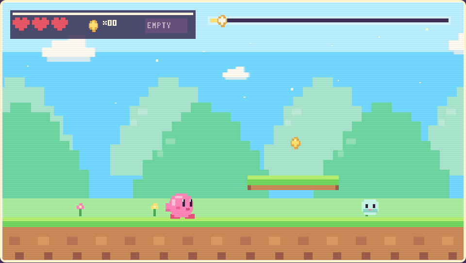

<p align="center">
  <a href="https://shemyu.github.io/single-page-games/">
    
  </a>
</p>

<h1 align="center">Single-Page Games</h1>

<p align="center">
  <strong>Tiny playable worlds, shipped as plain HTML.</strong>
</p>

<p align="center">
  <a href="https://shemyu.github.io/single-page-games/">Play the Arcade</a>
  &nbsp;|&nbsp;
  <a href="https://shemyu.github.io/single-page-games/games/mochi-sky/">Launch Mochi Sky</a>
  &nbsp;|&nbsp;
  <a href="./games/mochi-sky/">Browse the Game Source</a>
</p>

---

Single-Page Games is a small arcade shelf for browser games that open fast, feel handmade, and keep their whole world inside static files. No install flow. No backend. No heavy framework. Just a link, a tab, and a little pocket of play.

## Now Playing

### Mochi Sky

A pastel pixel side-scroller starring a round pink mochi hero. Jump across floating platforms, inhale enemies, fire star shots, and reach the end of the stage.

| Detail | Notes |
| --- | --- |
| Play | <https://shemyu.github.io/single-page-games/games/mochi-sky/> |
| Style | Pixel art, pastel skies, side-scrolling platformer |
| Status | Playable proof of concept |
| Controls | `Left` / `Right` or `A` / `D` to move, `Space` / `W` to jump, hold `X` to inhale, `C` to shoot, `R` to restart, `P` to pause |

## Brand Notes

- Fast to open: every game should be playable from a direct URL.
- Easy to share: each game lives in its own folder with relative links.
- Small by design: static HTML first, build tools only when they earn their keep.
- Playful on the surface, tidy underneath: the repo should stay easy to scan and remix.

## Arcade Map

```text
single-page-games/
|-- index.html
|-- assets/
|   `-- previews/
|       `-- mochi-sky.png
|-- games/
|   `-- mochi-sky/
|       `-- index.html
|-- .nojekyll
`-- publish-to-github.sh
```

## Publishing

The site is published with GitHub Pages from `main` at the repository root.

```bash
gh auth login
chmod +x publish-to-github.sh
./publish-to-github.sh
```

Live arcade: <https://shemyu.github.io/single-page-games/>
